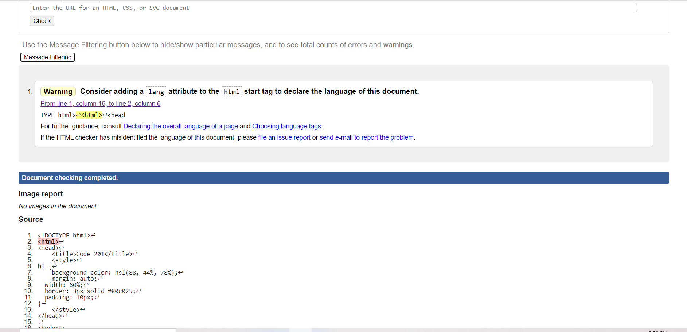

# code201
<!DOCTYPE html>
<html>
<head>
    <title>Code 201</title>
    
</head>

<body>
    <header>
         
    </header>
    <main>
        <h1>Class 1 Lab</h1>
        
Hi, what is your name?

        
What is your favourite country to travel to?

        
What is your most favorite food?

        
What kind of movies would you prefer to see?

        
         
    </main>
    <footer></footer>
    
</body>
</html>